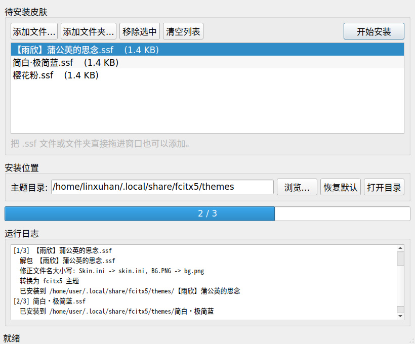

# fcitx5 搜狗皮肤安装器

把搜狗输入法的 `.ssf` 皮肤包转换成 fcitx5 主题，一键安装。

[](https://github.com/iamlinxuhan/fcitx5_skin_installer_sougou/actions/workflows/build.yml)
[](https://github.com/iamlinxuhan/fcitx5_skin_installer_sougou/releases/latest)
[](LICENSE)




## 简介

fcitx5 的「经典界面」支持换肤，但网上流传的皮肤绝大多数是搜狗输入法的 `.ssf` 格式，两者并不通用。本工具提供一个图形界面，把 `.ssf` 皮肤批量转换并安装成 fcitx5 主题，转换工作由内置的 `ssfconv` 完成，**不需要你另行安装任何命令行工具**。

## 功能特性

- **批量安装** — 一次选择多个 `.ssf` 文件或整个文件夹
- **开箱即用** — 打包产物内置全部依赖，不需要装 Python，也不需要装 `ssfconv`
- **自动修正文件名大小写** — 搜狗皮肤多在 Windows 上打包，包内常是 `Skin.ini` / `BG.PNG` 这类大写名，在 Linux 的大小写敏感文件系统上会导致转换失败，本工具会自动对齐
- **覆盖保护** — 遇到同名主题会先列出再询问，不会静默覆盖你已有的皮肤
- **安装位置可配置** — 默认 `~/.local/share/fcitx5/themes`，也可自行指定（Flatpak 用户见下方 FAQ）
- **可取消** — 安装过程中随时中止，不会留下半成品主题
- **拖拽添加** — 把 `.ssf` 文件或文件夹直接拖进窗口即可
- **详细日志** — 每个皮肤的处理过程都有记录，失败原因一目了然

## 下载安装

到 [Releases](https://github.com/iamlinxuhan/fcitx5_skin_installer_sougou/releases/latest) 页面下载对应架构的产物。

### AppImage（推荐，单文件）

```bash
chmod +x fcitx5-skin-installer-*-linux-x86_64.AppImage
./fcitx5-skin-installer-*-linux-x86_64.AppImage
```

aarch64 用户请下载 `linux-aarch64` 的版本。想接入桌面菜单的话，可以配合 [AppImageLauncher](https://github.com/TheAssassin/AppImageLauncher) 使用。

### tar.gz（免安装目录）

```bash
tar xzf fcitx5-skin-installer-*-linux-x86_64.tar.gz
./fcitx5-skin-installer/fcitx5-skin-installer
```

想接入桌面菜单，把附带的桌面条目和图标复制过去即可：

```bash
mkdir -p ~/.local/bin ~/.local/share/applications ~/.local/share/icons/hicolor/512x512/apps
cp -r fcitx5-skin-installer ~/.local/bin/
cp fcitx5-skin-installer/fcitx5-skin-installer.desktop ~/.local/share/applications/
cp fcitx5-skin-installer/fcitx5-skin-installer.png ~/.local/share/icons/hicolor/512x512/apps/
```

> 产物在 Ubuntu 24.04 上构建，需要 glibc 2.39 及以上。较老的发行版请从源码运行。

## 使用方法

1. 打开程序，点击「添加文件…」选择 `.ssf` 皮肤，或直接把文件拖进窗口
2. 确认「主题目录」（默认 `~/.local/share/fcitx5/themes`）
3. 点击「开始安装」
4. 安装完成后，在 fcitx5 里启用主题：
   - 图形界面：打开 `fcitx5-configtool` → 「附加组件」→「经典界面」→ 在「主题」下拉框中选择刚装好的皮肤
   - 或者直接改配置文件 `~/.config/fcitx5/conf/classicui.conf`：

     ```ini
     Theme=你的主题名
     ```

   - 改完执行 `fcitx5 -r -d` 重启输入法即可生效

## 从源码运行

需要 Python 3.10 及以上。

```bash
git clone https://github.com/iamlinxuhan/fcitx5_skin_installer_sougou.git
cd fcitx5_skin_installer_sougou

python -m venv .venv
source .venv/bin/activate
pip install -r requirements.txt

# ssfconv 尚未发布到 PyPI，需要从源码安装
pip install "ssfconv @ git+https://github.com/RadND/ssfconv.git@1.2.2"

python skin_installer.py
```

也可以用模块方式启动：`python -m fcitx5_skin_installer`

### 运行测试

```bash
python tests/test_converter.py
```

打包产物可以用内置自检确认依赖是否完整：

```bash
./fcitx5-skin-installer --self-test
```

## 工作原理

1. `.ssf` 本质是一个 zip（部分皮肤经过 AES 加密，需先解密），解包后得到 `skin.ini` 和若干图片
2. 修正包内文件名的大小写，使其与 `skin.ini` 中的引用一致
3. 解析 `skin.ini` 中的字体、配色、边距和拉伸区域，重绘出 fcitx5 需要的图片资源，并生成 `theme.conf`
4. 把结果目录复制到 fcitx5 的主题目录

整个过程在后台线程执行，界面不会卡住。

## 常见问题

**装完在 fcitx5 里找不到主题？**
确认主题目录正确。若你的 fcitx5 是 Flatpak 安装的，主题目录在 `~/.var/app/org.fcitx.Fcitx5/data/fcitx5/themes`，需要在程序里手动指定。另外记得重启 fcitx5（`fcitx5 -r -d`）让它重新扫描主题。

**提示「皮肤包内没有 skin.ini」？**
这个文件不是有效的搜狗皮肤包，可能下载不完整或格式不受支持。

**转换失败，提示皮肤包结构不完整？**
部分皮肤包缺少转换所需的字段（例如 `[Scheme_V1]` 段）。这类包本身不规范，换一个皮肤源试试。

**Wayland 下能正常显示吗？**
可以，打包产物同时包含 X11 和 Wayland 的平台插件。

## 依赖与许可

本程序的转换功能依赖以下第三方组件，它们均已随打包产物一同分发：

| 组件 | 用途 | 许可证 |
|---|---|---|
| [ssfconv](https://github.com/RadND/ssfconv) | `.ssf` 解包与格式转换 | GPL-3.0-or-later |
| [PyQt5](https://riverbankcomputing.com/software/pyqt/) | 图形界面 | GPL-3.0 |
| [Pillow](https://python-pillow.org/) | 图片处理 | MIT-CMU |
| [NumPy](https://numpy.org/) | 数值计算 | BSD-3-Clause |
| [pycryptodomex](https://www.pycryptodome.org/) | 加密皮肤包解密 | BSD-2-Clause / Public Domain |

由于分发的产物中包含了 GPL-3.0 许可的 ssfconv，本项目整体以 **GPL-3.0** 发布。详见 [LICENSE](LICENSE) 与 [THIRD_PARTY_NOTICES.md](THIRD_PARTY_NOTICES.md)。

## 致谢

转换能力来自 [ssfconv](https://github.com/RadND/ssfconv) 项目及其前身，感谢 nihui、VOID001、fkxxyz、RadND 等作者的持续维护。

## 许可证

[GPL-3.0](LICENSE) © iamlinxuhan
